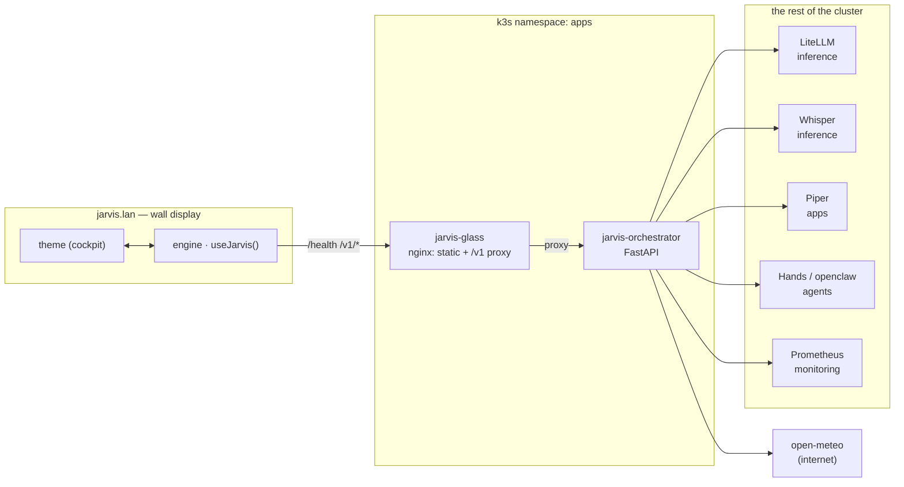
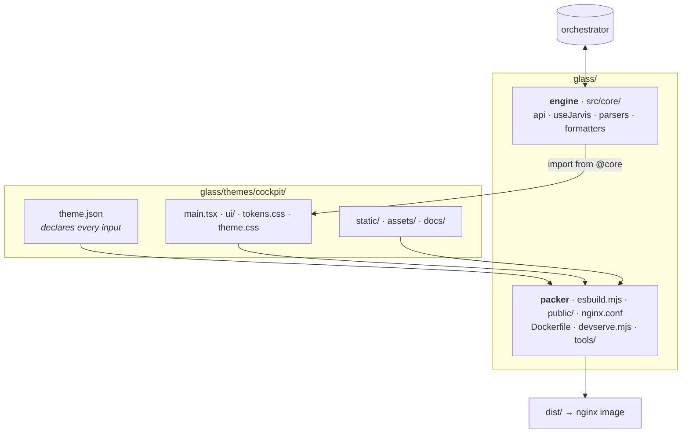
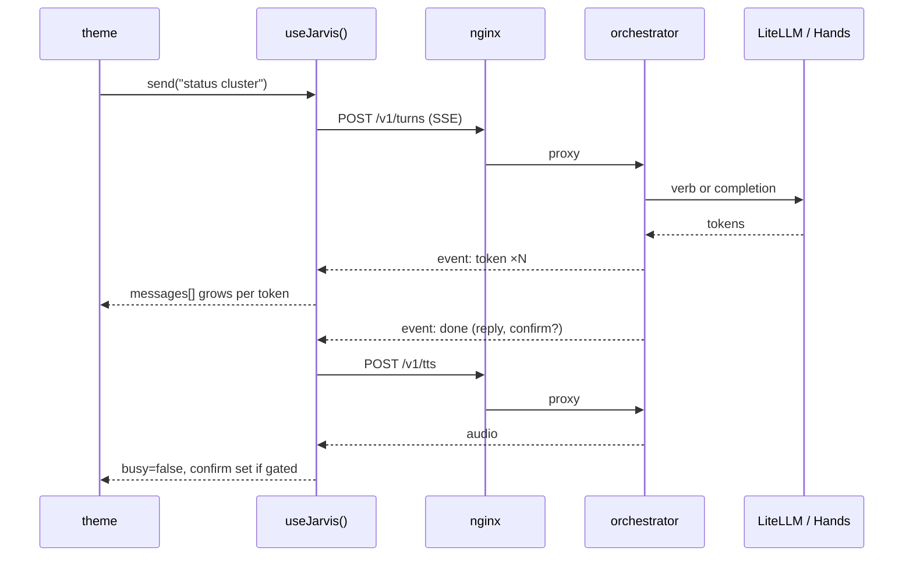

# Architecture

How the pieces fit. Process lives in [WORKFLOW.md](./WORKFLOW.md); the
engine/theme contract is [THEMES.md](./THEMES.md); law is [AGENTS.md](../AGENTS.md)
and jarvis-infra `docs/DECISIONS.md`.

## The shape of it

Two Deployments in namespace `apps` (D-0021). **glass** is a static nginx image
that also proxies the API; **orchestrator** is the only thing that talks to
anything else.

**The rule that shapes everything (D-0012):** glass talks *only* to the
orchestrator. It never reaches LiteLLM, Prometheus, Open WebUI or OpenClaw
directly. If a display needs a number, the orchestrator grows an endpoint —
that is why `/v1/pulse` exists.

## API surface

| Endpoint | Gives the UI |
| --- | --- |
| `GET /health` | service up/down: talker, hands, stt, tts, memory count |
| `GET /v1/pulse` | rack snapshot: nodes, rings, thermals, events, weather |
| `GET /v1/session` | greeting, parsed briefing, message history, pending confirm |
| `POST /v1/turns` | a turn, streamed back over SSE |
| `POST /v1/stt` | push-to-talk audio in, transcript out |
| `POST /v1/tts` | reply text in, audio out |
| `GET /readyz` | probe |

Anything the orchestrator cannot measure is `null`. Themes render an honest
placeholder — never a zero, never a plausible-looking number.

## glass: engine, packer, theme

`glass/` is **not** a theme. It is two things, and a theme is the third:

The test for where a file belongs: **if a second theme existed and cockpit were
deleted, would this still be needed?** If no, it is the theme's. That test is
what moved the globe textures, the IBM Plex fonts and the cockpit specs out of
`glass/` and into the theme.

Two boundaries the build refuses to cross (asserted in `esbuild.mjs`, so
`install-images.sh` cannot skip them):

- **core must not import a theme** — otherwise deleting a theme breaks the engine.
- **a theme must not touch the transport** — no `fetchSession`, `streamTurn`,
  `MediaRecorder`, `EventSource`, no relative import into `src/`. If a theme
  needs something, widen `useJarvis()` so the *next* theme gets it too.

## A turn, end to end

The theme never sees SSE, `MediaRecorder` or an audio element. It renders
`messages`, `busy`, `speaking`, `confirm` and calls `send()`.

Speech is streamed, not deferred: `useJarvis` splits the reply into sentences
as tokens arrive (`core/speech.ts`), keeps two Piper renders in flight, and
plays the clips in order. Rendering is deliberately decoupled from playback —
a first version only started the next render when the current clip ended,
which left a render-length silence between every sentence.

`interrupt()` cuts a reply short: it silences the TTS audio, aborts the stream
via `AbortController`, and marks the partial answer truncated. The orchestrator
catches the resulting `CancelledError` and persists the same partial with the
same marker — without that it drops the reply entirely and the session ends up
holding a question with no answer.

## Where state lives

| State | Owner | Notes |
| --- | --- | --- |
| Session, messages, confirm | orchestrator (sqlite on NFS) | survives a pod restart |
| Promoted memory | orchestrator (sqlite on NFS) | explicit remember/forget |
| Event journal | orchestrator, in-process | reseeds from node boot times |
| Poll state, stream buffers | engine (`useJarvis`) | per browser tab |
| Which display is showing | theme | the deck is not the engine's business |
