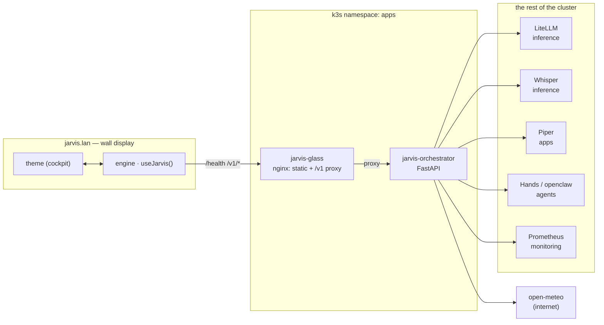
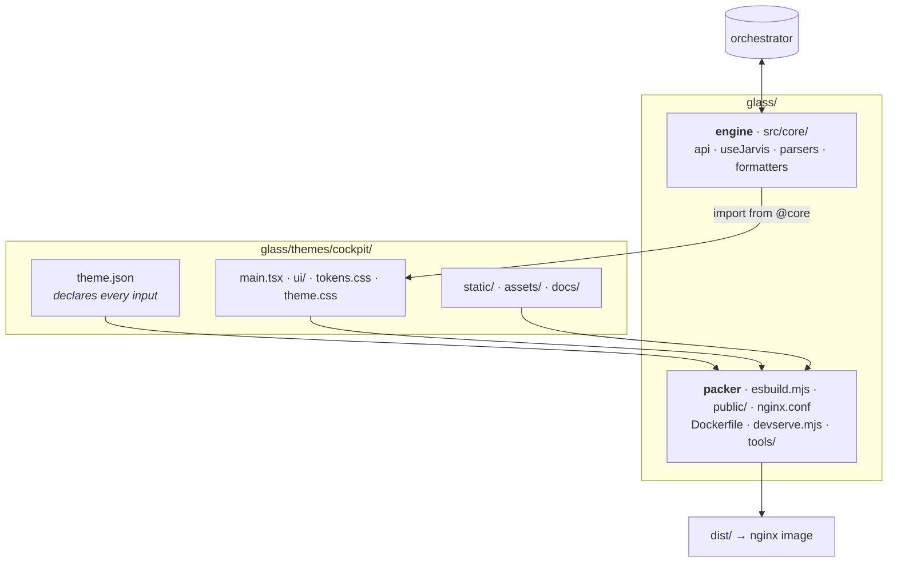
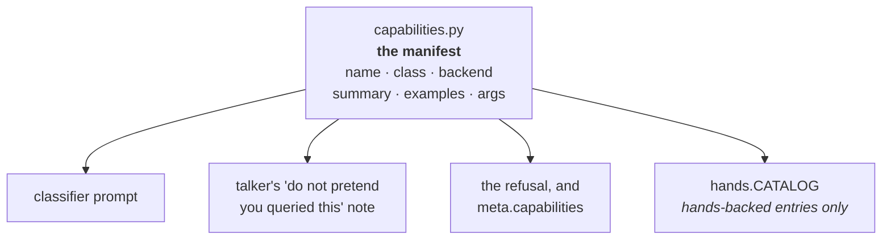
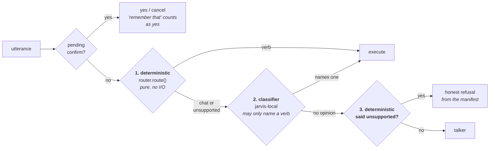
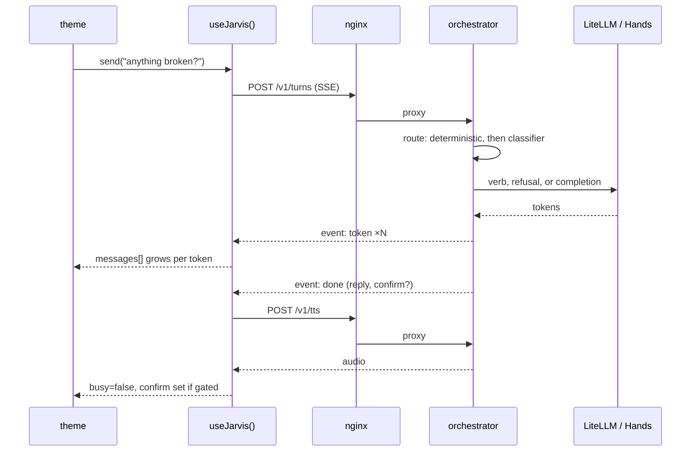

# Architecture

How the pieces fit. Process lives in [WORKFLOW.md](./WORKFLOW.md); the
engine/theme contract is [THEMES.md](./THEMES.md); law is [AGENTS.md](../AGENTS.md)
and jarvis-infra `docs/DECISIONS.md`.

## The shape of it

Two Deployments in namespace `apps` (D-0021). **glass** is a static nginx image
that also proxies the API; **orchestrator** is the only thing that talks to
anything else.

**The rule that shapes everything (D-0012):** glass talks *only* to the
orchestrator. It never reaches LiteLLM, Prometheus, Open WebUI or OpenClaw
directly. If a display needs a number, the orchestrator grows an endpoint —
that is why `/v1/pulse` exists.

## API surface

| Endpoint | Gives the UI |
| --- | --- |
| `GET /health` | service up/down: talker, hands, stt, tts, memory count |
| `GET /v1/pulse` | rack snapshot: nodes, rings, thermals, events, weather |
| `GET /v1/session` | greeting, parsed briefing, message history, pending confirm |
| `POST /v1/turns` | a turn, streamed back over SSE |
| `POST /v1/stt` | push-to-talk audio in, transcript out |
| `POST /v1/tts` | reply text in, audio out |
| `GET /readyz` | probe |

Anything the orchestrator cannot measure is `null`. Themes render an honest
placeholder — never a zero, never a plausible-looking number.

## glass: engine, packer, theme

`glass/` is **not** a theme. It is two things, and a theme is the third:

The test for where a file belongs: **if a second theme existed and cockpit were
deleted, would this still be needed?** If no, it is the theme's. That test is
what moved the globe textures, the IBM Plex fonts and the cockpit specs out of
`glass/` and into the theme.

Two boundaries the build refuses to cross (asserted in `esbuild.mjs`, so
`install-images.sh` cannot skip them):

- **core must not import a theme** — otherwise deleting a theme breaks the engine.
- **a theme must not touch the transport** — no `fetchSession`, `streamTurn`,
  `MediaRecorder`, `EventSource`, no relative import into `src/`. If a theme
  needs something, widen `useJarvis()` so the *next* theme gets it too.

## How a turn is routed

Law is jarvis-infra **D-0033 / D-0034 / D-0035**. This is the shape.

Everything JARVIS can do is declared once, in
`orchestrator/app/capabilities.py`. Four things read that manifest, which is
why it exists — before it did, each knew a different partial version and
JARVIS confidently denied having abilities he had:

A turn resolves in stages, cheapest first. Only a turn that gets past the
deterministic pass costs a model call:

**The talker has no tools, and never will** — that is D-0033's first line and
VISION's rule, because the 7B fake-called them. The classifier is a separate
call that returns a *label*; `classify.parse_verdict` rejects any name outside
the manifest, so an invented `cluster.nuke` becomes nothing.

**The classifier may only promote.** It can name a verb. It cannot turn a
refusal into chat, and it cannot invent a refusal. That split is measured, not
assumed: `jarvis-local` is good at "which verb did he mean" and bad at "is
this a capability at all". Letting it do both made the whole thing a wash
(D-0034).

**Each side owns what it is good at.** `router.is_house_request` decides
"nothing serves this subject" from a list of subjects no capability covers —
a fact about the manifest rather than a guess. Add a capability for one of
those subjects and you delete its word from that list in the same commit;
`test_capabilities.py` fails if you forget.

**Degradation is deliberate.** A classifier timeout or a malformed reply
changes nothing — the deterministic route stands. The router keeps working
with the talker down, which is VISION's "it stays up when it is sick". The
same reasoning is why several capabilities are served by the orchestrator
itself from Prometheus rather than through the shim (D-0036): they still
answer when Hands is down, which is when the question gets asked.

**The manifest is the list.** Do not enumerate capabilities in prose anywhere,
including here — ask JARVIS ("what can you do?"), or read
`orchestrator/app/capabilities.py`. Two copies of that list is how the docs
started arguing with the cluster in the first place.

**"that" resolves against the previous turn** (D-0035) from a durable
per-session referent store, and always through the ordinary Confirm/Cancel —
an inference about what Gordon meant is never written on its own.

### Changing the router

Adding a phrase to a regex to catch one more sentence is the treadmill this
was built to end. In order of preference:

1. **Add the utterance to `orchestrator/tests/fixtures/utterances.tsv`** with
   the label it should get, and leave it failing. That is a recorded miss, not
   a bug, and it is how the classifier's next evaluation gets a target.
2. **Add a capability** to the manifest if the thing genuinely cannot be done
   — a row plus a decision entry. The router picks it up with no router change,
   which is the point of the manifest.
3. Only then consider a pattern, and only for a closed set of phrasings that
   cannot mean anything else (the referent phrases are the example).

The gate in `tests/test_router.py` asserts three absolute counts — plain chat
captured by a capability, ordinary questions refused, and requests JARVIS
*can* serve refused — all of which must be **zero**, plus a capability-pass
floor. `scripts/install-images.sh` runs the suite before it builds, so a
failing gate stops the ship.

## A turn, end to end

The theme never sees SSE, `MediaRecorder` or an audio element. It renders
`messages`, `busy`, `speaking`, `confirm` and calls `send()`.

Speech is streamed, not deferred: `useJarvis` splits the reply into sentences
as tokens arrive (`core/speech.ts`), keeps two Piper renders in flight, and
plays the clips in order. Rendering is deliberately decoupled from playback —
a first version only started the next render when the current clip ended,
which left a render-length silence between every sentence.

`interrupt()` cuts a reply short: it silences the TTS audio, aborts the stream
via `AbortController`, and marks the partial answer truncated. The orchestrator
catches the resulting `CancelledError` and persists the same partial with the
same marker — without that it drops the reply entirely and the session ends up
holding a question with no answer.

## Where state lives

| State | Owner | Notes |
| --- | --- | --- |
| Session, messages, confirm | orchestrator (sqlite on NFS) | survives a pod restart |
| Referents — what "that" means | orchestrator (sqlite on NFS) | D-0035; cleared per turn when nothing was found |
| What JARVIS can do | `app/capabilities.py` in git | the manifest; `hands.CATALOG` derives from it |
| Promoted memory | orchestrator (sqlite on NFS) | explicit remember/forget |
| Event journal | orchestrator, in-process | reseeds from node boot times |
| Poll state, stream buffers | engine (`useJarvis`) | per browser tab |
| Which display is showing | theme | the deck is not the engine's business |
