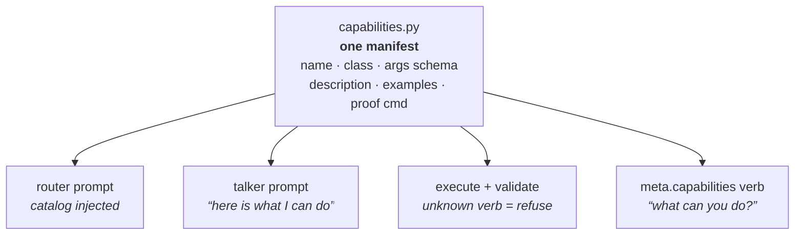
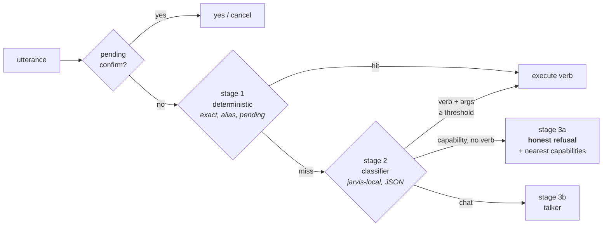

# Intent router — slice plan

**Law is jarvis-infra D-0033** (2026-09-21), which this file does not restate.
This is the working spec: the measurement that justified it, the design in
detail, and the slice tracker.

**Delete this file when the last slice lands.** `jarvis-infra/docs/PLAN.md` is
the gravestone explaining why a spec that has served its purpose does not stay
in circulation; D-0033 is the durable record, and the code is the rest.

| Slice | State |
| --- | --- |
| 0 — live bugs | **shipped** 2026-09-21, orchestrator v0.6.27 |
| 1 — eval fixture + gate | **shipped** 2026-09-21, orchestrator v0.6.28 |
| 2 — manifest + honest refusal | next |
| 3 — local classifier (shadow → on) | |
| 4 — conversational referents | |

Measurements were taken against live `jarvis.lan` on 2026-09-21, orchestrator
`v0.6.26` — i.e. **before** slice 0. The throwaway fixture and scorer that
produced the baseline are in `~/jarvis-eval-baseline/`; slice 1 promotes them
into the repo.

> **This does not give the talker tools.** The 7B still receives no tool
> definitions and never emits a tool call. A separate constrained *classifier*
> call returns a **label** — a verb name from a declared catalog — which the
> orchestrator validates and executes through the OpenClaw shim under its own
> RBAC. A model that names a verb outside the catalog is refused, exactly as
> today. This is the path D-0022 pre-authorised: *"ingress regex on the
> orchestrator for v1; may add LLM classify later without changing the verb
> boundary."* VISION's rule — *"Intelligence in the router, not regex on
> English"* — is the thing being fixed, not bent.

---

## 1. What is actually wrong

Not the verbs, and not the talker. Both work. The **router** is a list of 7
regexes over English in `hands.py` and `memory.py`, and everything it misses
falls silently into a toolless 7B that answers anyway.

### Measured, live

A fixture of 89 utterances — Gordon's own examples plus near-miss paraphrases
and plain-chat negatives — run through the production routing order
(`parse_memory_intent` → `parse_memory_candidate` → `match_verb` → talker):

| Expected | Pass | Rate |
| --- | --- | --- |
| plain chat (must stay chat) | 22/25 | 88% |
| `cluster.health` | 5/12 | 42% |
| `cluster.gpus` | 4/6 | 67% |
| `lab.map` | 2/5 | 40% |
| `apps.recycle_pod` | 0/3 | 0% |
| `apps.restart_deploy` | 3/4 | 75% |
| memory: list | 3/8 | 38% |
| memory: remember | 6/8 | 75% |
| memory: forget | 3/6 | 50% |
| capability asked, no verb exists | 0/12 | 0% |
| **total** | **48/89** | **54%** |
| — of which **capability subset** (excl. chat) | **26/64** | **41%** |

Read the two denominators separately. "54% overall" is gameable: adding 50 more
chat negatives pushes it past 70% with no routing improvement at all. The two
numbers that mean something are **chat false-positives (absolute count)** and
**capability recall on the 64 capability utterances**.

**The recorded gate moved twice, both times for honesty.** One of the original
26 was `remember that` scoring as a pass *because of* the bug — it "succeeded"
by storing the word "that" — so slice 0 dropped it to 25. Slice 1 then split
the coarse buckets into the router's real label namespace
(`memory.candidate` / `.forget_all` / `.remember_ref` are distinct outcomes the
old scoring had been checking against the wrong name) and narrowed the `gpu`
regex. Current recorded gate, on shipped code:

| | before slice 1 | after |
| --- | --- | --- |
| chat false-positives | 3 | **0** |
| capability passes | 25 | **28** of 52 |

Of the +3, two are real recall — the narrowed `gpu` rule lets *are the graphics
cards running warm?* and *how much video memory is free?* route — and the rest
is label precision. The 12 `uncovered` utterances are tracked separately: they
have no verb behind them, so they are slice 2's honest refusal rather than a
recall failure. Counting a bug as a pass is exactly how a gate rots, which is
why the history is written into `test_router.py` rather than folklore.

**36 of 89 capability requests reach the toolless talker**, which then invents
an answer. Verbatim from the live host:

```
> are there any issues with the cluster today?
  "I do not have live cluster data to check for issues, sir. The last update
   I recall was from yesterday, and everything was functioning as expected."
     ← invented. There was no update, and it holds no yesterday.

> list all the running pods for me
  "I'm afraid I don't have the ability to list running pods or query the
   cluster directly, sir."
     ← the first clause is fair — no verb returns a pod list today, only a
       summary. "or query the cluster directly" is false: cluster.health,
       cluster.gpus and lab.map all do exactly that, and he had just
       answered a cluster question two turns earlier.

> show me all your saved facts and memories
  "I'm afraid I can't display a list of my saved facts and memories…"
     ← false. "list memories" works; "show me all your…" does not match.
```

### The leak runs the other way too

`what is a GPU?` — an example Gordon cited as working — does **not** work:

```
> what is a GPU?
  "GPU status: gpu-01 68°C, 5.9 GiB used; gpu-02 59°C, 0.8 GiB used."
  [verb: cluster.gpus]
```

The `cluster.gpus` regex matches the bare word `gpu`, so three general
questions in the fixture (`what is a GPU?`, `is a GPU better than a CPU for
inference?`, `what temperature should a GPU run at?`) are captured by a verb.
Every future keyword added to widen recall widens this leak. That is why the
eval fixture gates the work rather than following it.

### Five distinct failures, not one

1. **Phrasing brittleness.** `cluster status` hits; `are there any issues with
   the cluster today?` does not. Gordon is keyword-hunting because the router
   is literally a keyword list.
2. **Catalog too small.** Five verbs. Files, backups, Flux state, logs, disk
   and pod listings have no verb at all, so they cannot be answered honestly.
3. **Silent fall-through.** A missed capability question is indistinguishable
   from small talk, so it is handed to a model with no data and a strong prior
   toward being helpful. The hallucinations above are the mechanism working as
   built.
4. **No conversational referents.** `remember that`, `delete that last one`,
   `scratch that` all point at a previous turn. Nothing tracks one.
5. **No self-knowledge.** JARVIS cannot answer *"what can you do?"* because the
   catalog exists only as Python dict keys and is never shown to him.

### Two live bugs found on the way

- **`hands.py:166` — `ALLOW_NS` is undefined.** Any confirm-class utterance
  containing a `namespace/name` token raises `NameError`. Verified live:
  `POST /v1/turns "restart deploy apps/jarvis-glass"` → **HTTP 500**.
- **`remember that` stores the literal fact `"that"`.** `_REMEMBER` captures
  the trailing word. It is already in the production store — `list memories`
  on jarvis.lan returns `9. that`. `forget that` then substring-matches `that`
  against every stored fact, so the blast radius is not one row.

---

## 2. The design

One **capability manifest** is the single source of truth, and it feeds three
consumers that today each know a different, partial version of the truth.

**The manifest covers memory, not just the rack.** Five of the eight memory
failures in §1 (`show me all your saved facts and memories`, `what do you
remember about me`, `read back my preferences`, …) are phrasing brittleness in
`memory.py`, which is a second regex router sitting in front of the first. If
`memory.list` / `memory.remember` / `memory.forget` are not manifest entries the
classifier never sees them, and slice 3 would leave a third of Gordon's examples
exactly as broken as today. They are already half-named: `main.py` emits
`verb: "memory.forget"` and `"memory.remember"` in its confirm payloads. The
manifest makes that real — same catalog, same validation, same classifier,
different backend (sqlite instead of the shim).



A turn resolves in three stages, cheapest first:



**Stage 1 — deterministic.** Exact verb names, `yes`/`cancel`, explicit
`remember that <fact>`, unambiguous aliases. Zero latency, zero model risk.
Keeps the fast path fast and keeps a classifier outage from breaking the
basics.

**Stage 2 — classifier.** One non-streaming, temperature-0, JSON-only call to
`jarvis-local` — **on the rack's own GPU, no internet hop** — with the catalog
injected:

```json
{"verb": "cluster.health" | null, "args": {}, "kind": "capability" | "chat",
 "confidence": 0.0-1.0}
```

Three hard constraints, all orchestrator-side:

- a `verb` not in the catalog → treated as `null`. The model cannot invent one.
- `args` are validated against the manifest schema before execution; the shim
  re-validates (`WRITE_NS`, `NAME_RE`) as it already does.
- classifier timeout or malformed JSON → fall through to stage 3, never to a
  guessed verb. Same failure discipline as D-0025's extractor.

Latency is affordable: a full live turn including system prompt and a one-word
reply measured **0.82 s** end to end. A ~30-token JSON classify is a fraction
of that.

**Stage 3a — honest refusal, the important half.** `kind: "capability"` with no
verb must **never** reach the talker. It answers from the manifest:

> *"I can't read Flux logs — that isn't one of my verbs, sir. I can give you
> cluster health, GPU metrics and the lab map. Shall I name a new verb for
> Flux?"*

This one rule kills all three hallucinations quoted above, and it is worth
shipping even if the classifier were never added.

**Stage 3b — talker.** Unchanged, and still toolless.

### Conversational referents

A small per-session referent stack — `last_candidate`, `last_memory_write_id`,
`last_verb`, `last_assistant_reply` — stored beside the existing pending
confirm in `sessions.sqlite`. `remember that` resolves to `last_candidate`;
`delete that last one` resolves to `last_memory_write_id`.

Resolving a referent is a model inference about what Gordon meant, and D-0013
says an inference is never auto-written. So a resolved referent goes through
the **existing confirm gate**, unchanged:

> *"Shall I remember: Gordon likes to be addressed as sir? Say yes or cancel."*

That is both law-compliant and the behaviour Gordon actually described wanting.

---

## 3. No new verbs in this work

Gordon's examples — Flux logs, backups, directory listings, "the latest backup"
— were **illustrations of the class of thing he wants**, not a feature request.
On 2026-09-21 he confirmed: no new verbs for now; more command skills come
later.

That makes this work purely a **router** change, which is the right shape
anyway. The catalog stays exactly as D-0022 and D-0023 named it:

| Verb | Class | Status |
| --- | --- | --- |
| `cluster.health`, `cluster.gpus`, `lab.map` | trusted | unchanged |
| `apps.recycle_pod`, `apps.restart_deploy` | confirm | unchanged |
| `memory.list` / `.remember` / `.forget` | trusted / confirm | **already exist** — they just join the manifest so the classifier can see them |
| `meta.capabilities` | trusted | **new, but not a capability** — it reads the manifest and nothing else. No RBAC, no backend, no blast radius. It is how JARVIS answers "what can you do?" |

No RBAC widen. No new OpenClaw skill. No change to the `openclaw-recycle` Role.
When Gordon does name new verbs, they are a decision entry and a manifest row —
and because the manifest feeds the router, the classifier picks them up with no
router change at all. That is the point of doing this first.

## 4. Slices

Each is independently deployable through the normal loop (`VERSION` bump →
`install-images.sh` → pin in `~/cluster` → Flux → verify on jarvis.lan).

**Slice 0 — the live bugs. ✅ shipped (orchestrator v0.6.27).**
Define `ALLOW_NS` in `hands.py`. Add one trailing-pronoun guard shared by
`_REMEMBER` **and** `_FORGET` — `forget that` has the identical bug
(`fact="that"`, then `_forget_match` substring-matches `that` against every
stored fact; confirm-gated, so it cannot silently destroy, but it is the same
root cause and the same one-line fix). Delete the `that` row from the
production store. Regression tests for each.

Interim behaviour, since referents do not exist until slice 4: a bare
`remember that` / `forget that` gets an honest *"I'm not sure which part you'd
like me to remember, sir — say it again?"* rather than storing garbage. Slice 4
makes it resolve.

**Slice 1 — the eval fixture, against today's code.** The gate for everything
after it. `orchestrator/tests/fixtures/utterances.yaml` — every utterance with
its expected route, including a large block of plain-chat negatives that must
route to `chat`. A pytest that scores it and asserts two things:

- **chat false-positives = 0**, as an absolute count on the chat subset
  (protects what already works — and note this fails *today* at 3, so slice 1
  starts by narrowing the `gpu` regex)
- **capability passes ≥ 28**, as an absolute count, not a rate. Absolute so
  that adding cases can only ever make the gate stricter; a rate over the mixed
  set climbs when you add negatives, which lets a gate rot while looking
  healthier.

Gordon sees one table per slice, and the two numbers moving in opposite
directions is the evidence that the router got better rather than louder.

**Slice 2 — the manifest and the honest refusal.** Extract `CATALOG` into a
real manifest with descriptions, examples and arg schemas. Add
`meta.capabilities`. Add stage 3a: a capability-shaped question with no verb
gets the manifest-derived refusal instead of the talker. Router still regex —
this slice adds **no** model call and still removes every hallucination in §1.

**Slice 3 — the classifier.** Stage 2 against `jarvis-local`, catalog-injected,
validated. Ship behind `ROUTER_CLASSIFIER=off|shadow|on`:

- `shadow` logs the classifier's answer beside the regex decision without
  acting on it, so a day of Gordon's real traffic scores the model before it
  can affect a turn.
- Promote to `on` only when the fixture passes with chat false-positives at 0.

**Slice 4 — referents.** The referent stack, confirm-gated. Fixes `remember
that`, `delete that last one`, `scratch that`.

There is no slice 5. New verbs are later work (§3), and by then the manifest
makes them a row plus a decision entry rather than a router change.

### The fork in slice 3 — and why it stays local

Classification accuracy on a ~10 verb catalog is the load-bearing unknown, and
VISION carries a scar on this exact ground (*"The 7B fake-called tools; that is
why this rule exists"*). Shadow mode answers it with data rather than optimism.

**Routing decisions stay on local compute.** Gordon's standing instruction
(2026-09-21): rely on local compute and local models for JARVIS's own
decision-making; outbound calls to internet LLMs are limited to where they earn
it. Routing is the worst possible place for a cloud hop — it is on the critical
path of *every* turn, it is the part that must keep working when the house is
sick, and VISION's third property is *"it stays up when it is sick."* A router
that needs xAI to decide whether Gordon asked about a GPU is a router that
fails during exactly the outage he most needs it.

So if `jarvis-local` cannot hold chat false-positives at 0 with decent recall,
the escalation ladder is, in order:

1. Tighter rubric — few-shot examples drawn from the fixture's own failures.
2. Constrained decoding: Ollama supports a JSON schema / grammar on the
   response, which removes malformed-JSON failures entirely.
3. A second **local** model pinned for classification only. gpu-02 currently
   runs embeddings with VRAM free; a small instruct model there is a decision
   about that node, not about leaving the LAN.
4. Deterministic fallback: if all of the above fail, keep regex stage 1, keep
   the honest refusal, and drop stage 2. A router that admits it is unsure
   beats one that guesses.

`jarvis-grok` as classifier is **not** on this ladder. It would change D-0019's
pinned Classifier role and put the house's reflexes on the internet. If it is
ever wanted it is a deliberate decision, never a fallback someone reaches for
on a bad afternoon.

---

## 5. What this deliberately does not do

- No tools for the talker. No `tools` array, no tool-call parsing, no
  `supports_function_calling` flip on `jarvis-local`.
- No agent loop. One classify, one verb, one reply. Multi-step planning is not
  in scope and should be its own decision if it is ever wanted.
- No RBAC widen, and no new verbs — §3.
- No cloud model in the routing path. Local compute decides; see the ladder in
  slice 3.
- No change to `keyword_tier_rules` or the LiteLLM `jarvis` auto-router. Product
  traffic does not use it (D-0019) and the BACKLOG ticket for
  `classifier_type: llm` is a **separate** piece of work on the break-glass
  chat.lan path. Confusing the two would be easy and wrong.

---

## Appendix A — the decision

Written to jarvis-infra `docs/DECISIONS.md` as **D-0033** on 2026-09-21. Read
it there; it is authority #2 and this file is prose.
