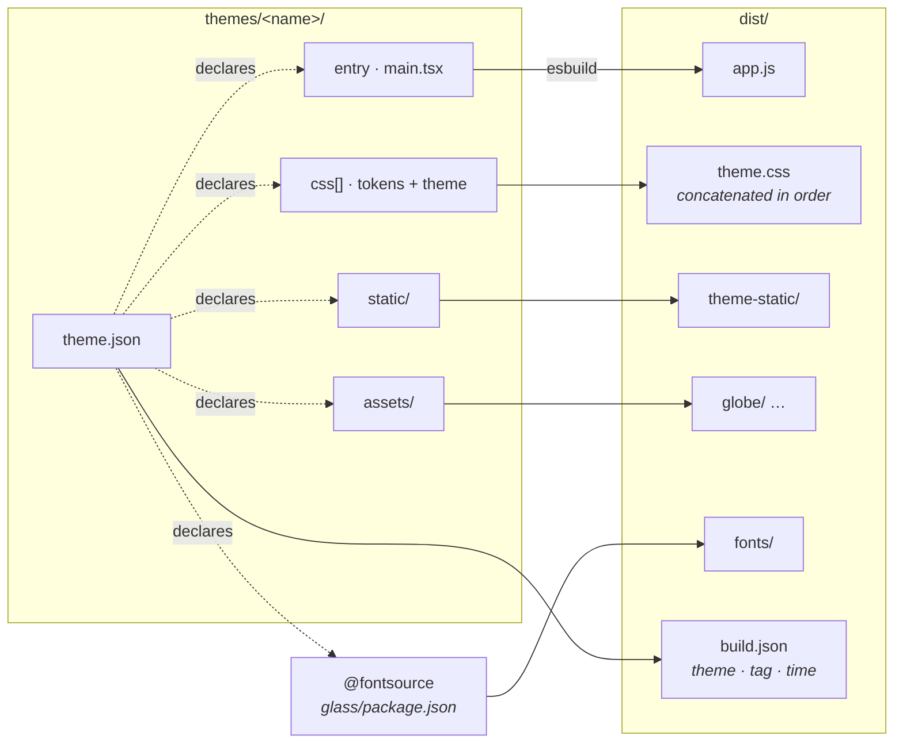

# Theme library — the glass build-then-ship contract

Glass is one engine plus one theme, chosen at build time. The engine is the
same for every theme; the theme decides the entire UI/UX. This file is the
contract: if a new theme satisfies it, `JARVIS_THEME=<name>` builds and ships.

Law is `AGENTS.md` here and jarvis-infra `docs/DECISIONS.md` (D-0020, D-0031,
D-0032). This is architecture, not law.

## The split

**glass is two things, and neither is a theme:**

- **The engine** — `src/core/`. Everything between the orchestrator and the
  surface: transport, polling, streamed turns, TTS, push-to-talk, parsing. It
  is headless and has no opinion about layout, navigation, or how many screens
  exist. A theme consumes it through one hook.
- **The packer** — `esbuild.mjs`, `public/index.html`, `nginx.conf`,
  `Dockerfile`, plus `devserve.mjs` and `tools/` for the bastion loop. It
  builds and serves whichever theme is selected.

**A theme is the surface, and everything only it needs** — components, CSS,
images, fonts, its own spec and reference frames.

The test for where something belongs: *if a second theme existed and cockpit
were deleted, would this still be needed?* If no, it is the theme's. That test
moved the Blue Marble textures, the IBM Plex fonts, `DESIGN.md`, `COCKPIT.md`,
`COCKPIT-PLAN.md` and `docs/reference/` out of glass and into the theme.

```
glass/
  src/core/            the engine — every theme gets exactly this
    api.ts             transport to the orchestrator (/health, /v1/*)
    useJarvis.ts       all product behaviour as one hook
    session.ts         briefing parsing, copy caps, poll cadence
    pulse.ts           generic formatters (steelNum, formatRate, gpuChips…)
    chat.ts            ChatMsg, ids, dayOfYear
    index.ts           the public surface — themes import "@core"
  themes/<name>/
    theme.json         manifest — the complete declaration of the theme's inputs
    main.tsx           entry: mount your root into #app
    tokens.css         your palette
    theme.css          the look
    ui/                your components — anything you like
    static/            copied to /theme-static/*
    assets/            whatever you declare, e.g. assets/globe -> /globe/*
    docs/              your spec, visual contract, reference frames
```

## Manifest

Nothing reaches `dist/` that the manifest does not name.



```json
{
  "name": "cockpit",
  "title": "Cockpit",
  "description": "one line, shown to the operator",
  "entry": "main.tsx",
  "css": ["tokens.css", "theme.css"],
  "static": "static",
  "assets": [{ "from": "assets/globe", "to": "globe" }],
  "fonts": [{ "pkg": "ibm-plex-sans", "weight": 400, "as": "plex-sans-400.woff2" }],
  "displays": ["login", "earth", "cmd", "noc"],
  "docs": "docs"
}
```

- `name` must equal the directory.
- `css` is concatenated **in order** into `dist/theme.css` — tokens before the
  pack, or the cascade breaks.
- `assets[].from` resolves theme-relative first, then glass-relative, so two
  themes can share one copy of something large without either owning it.
  `to` is the path under `dist/`.
- `fonts[]` pulls the `latin` subset from `@fontsource/<pkg>` and writes it to
  `dist/fonts/<as>`. `as` is explicit because your `@font-face` `src:` already
  names that file — the packer used to hardcode both the subset and the name.
  `@fontsource` packages live in `glass/package.json`; a declared font that is
  not installed is a build error, not a silent skip into unstyled text.
- `displays` and `docs` are descriptive. The deck, the routes and the number
  of screens belong to the theme, not the engine.

`dist/` is wiped at the start of every build. It used to only ever be added
to, so a file deleted from a theme kept shipping — and building theme B over a
theme A `dist` would have produced an image containing both.

## The two rules, enforced by the build## The two rules, enforced by the build

`esbuild.mjs` asserts both before it compiles, so `install-images.sh` cannot
skip them:

1. **Core must not import a theme.** If it does, deleting a theme breaks the
   engine — which is how `src/api.ts` used to import a type out of the cockpit
   pack.
2. **A theme must not touch the transport.** No `fetchSession`, `streamTurn`,
   `MediaRecorder`, `EventSource`, and no relative import into `src/`. If a
   theme needs something the hook does not expose, widen `useJarvis` so the
   *next* theme gets it too.

The second rule is the one that matters. Before the split, `src/cockpit/App.tsx`
and `src/hud/App.tsx` each carried their own copy of session polling, SSE
turns, TTS and push-to-talk — roughly 350 lines duplicated per theme. A third
theme would have been a third copy.

## What a theme gets

```ts
const j = useJarvis();
```

| | |
| --- | --- |
| `greeting` `blurb` `briefing` | `/v1/session`, briefing already parsed |
| `messages` | `ChatMsg[]`, live tokens appended while streaming |
| `health` `pulse` | polled every 8s / 2s |
| `status` | `live` `unreachable` `degraded` `reason` `talker` `hands` `stt` `tts` `memoryFacts` |
| `confirm` | pending confirm-gated verb (D-0023), or null |
| `busy` `recording` `micDenied` | in-flight state |
| `lastTurn` | `{user, assistant}` — the cockpit draws it as a toast; yours need not |
| `sessionAt` | epoch ms of the last successful session fetch |
| `send(text)` | a turn over SSE |
| `startPtt()` `stopPtt()` | push-to-talk capture → `/v1/stt` |
| `refetchSession()` | reload; **no navigation side effects** |
| `answerConfirm(ok)` | sends `yes` / `cancel` |

Null means "not measured". Render an honest placeholder — never a zero, never a
plausible-looking number (`AGENTS.md`, and the theme's own spec).

## Dependencies

`three`, `@react-three/*` and `motion` sit in the single `glass/package.json`
rather than per-theme workspaces. That is deliberate: esbuild only bundles what
is imported, so a dependency no theme uses costs nothing in the output, and the
boundary that actually matters is enforced below. Do not "fix" this into
workspaces without a reason beyond tidiness.

## Adding a theme

1. `mkdir glass/themes/<name>` and write `theme.json` + `main.tsx`.
2. Render `useJarvis()` however you like. Import only from `"@core"`.
3. `JARVIS_THEME=<name> npm run build`, then `node tools/drive.mjs` against
   `devserve.mjs` to check it (see `glass/README` notes in the repo README).
4. Point `VERSION`'s `JARVIS_THEME` at it and ship. One image per theme.

## Which theme is deployed?

The bundler writes `dist/build.json`, so the artifact is self-describing:

```bash
curl -sk https://jarvis.lan/build.json
```

Two images that differ only by theme used to be indistinguishable.

## Current library

| Theme | Status |
| --- | --- |
| `cockpit` | the product pack (D-0031 / D-0032) |

`godseye`, `mark-hud` and `archive-gold` were deleted in v0.6.44. They were CSS
packs without entry points, so building them silently fell through to a legacy
`src/main.ts` and shipped a different app than the name implied.
