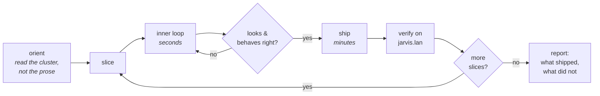
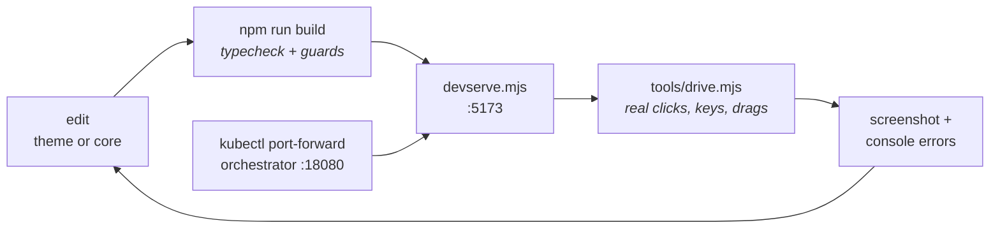
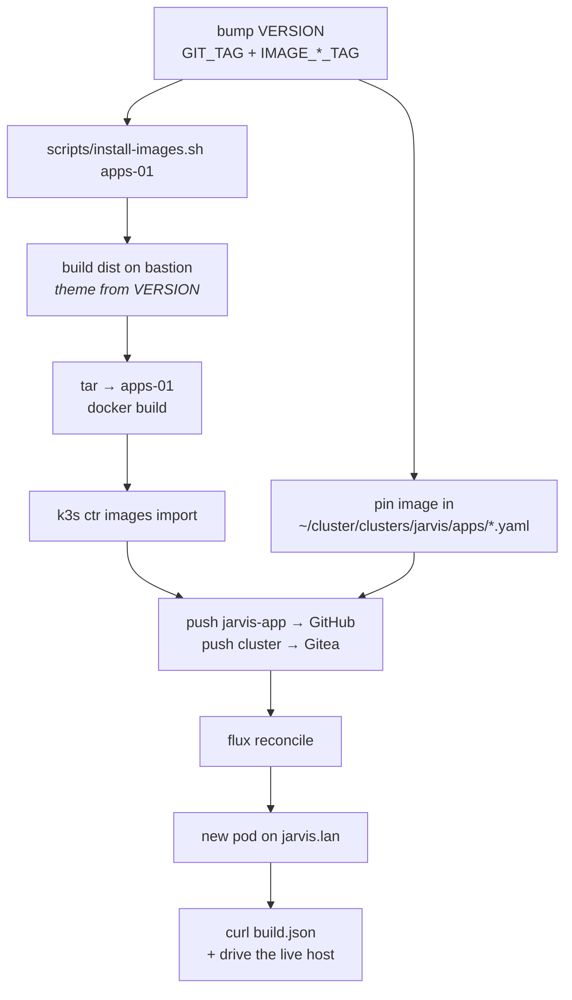

# Workflow

How work gets done in this repo, and what the operator and an agent expect of
each other. This is **process, not law** — law is [AGENTS.md](../AGENTS.md) and
jarvis-infra `docs/DECISIONS.md`, and a dated decision outranks anything here.
Structure is [ARCHITECTURE.md](./ARCHITECTURE.md).

## The shape of a session

Work ships in **slices**: one display, or one data layer, or one coherent
change. A slice is built, validated, and deployed before the next one starts,
so progress lands on the wall display instead of accumulating in a branch.



**Exception:** a pure refactor whose success criterion is "indistinguishable
from before" has no visible progress to show. Commit it in slices, deploy it
**once**, and prove parity instead.

## Inner loop — the bastion dev server

Never rebuild an image to look at a CSS change. `devserve.mjs` serves `dist/`
and proxies `/v1` to a real orchestrator, so the UI runs against live cluster
data in seconds.



```bash
# node lives here
export PATH="$HOME/.local/node-v22.14.0-linux-x64/bin:$PATH"

kubectl -n apps port-forward svc/jarvis-orchestrator 18080:8080 &
cd ~/jarvis-app/glass && npm run build && node devserve.mjs
# http://127.0.0.1:5173/#login | #breath | #cmd | #noc
```

## Validating a change

Four checks, in the order they catch things:

1. **`npm run build`** — typecheck plus the boundary guards. It fails the build;
   it does not warn.
2. **Drive it, don't just screenshot it.** `tools/drive.mjs` dispatches real
   input events and reports console errors. Static screenshots have missed a
   global Enter handler that jumped the deck on every message send, and a deck
   swipe that ate the globe drag — neither is visible in a still.
3. **Render the degraded state.** Point `ORCH` at a closed port. Every panel has
   a null path and they are easy to break without noticing.
   ```bash
   PORT=5174 ORCH=http://127.0.0.1:19999 node devserve.mjs
   ```
4. **Check more than one window size** if you touched layout. 1272×620 and
   3070×1600 have both exposed real bugs that 1920×1080 did not.

For a refactor, capture a **structural signature** (tag/class tree plus rounded
rects, text stripped) of each display before you start and diff it after.
Pixel-diffing does not work here — the globe rotates, the waveform animates,
clocks tick, pulse changes.

## Shipping



Rules that bite if ignored:

- **Never retag.** Image tags are immutable; `imagePullPolicy: Never` means a
  reused tag silently serves the old bits.
- **`VERSION` is the source of truth** for both the tag and the theme.
  `install-images.sh` sources it and refuses to build an unknown theme.
- **Flux does not watch this repo.** The image pin lives in `~/cluster` → Gitea.
  Pushing jarvis-app alone deploys nothing.
- **A pod swap briefly 404s.** `build.json` failing to parse seconds after a
  reconcile is traefik routing to a terminating pod, not a bad build. Retry.

Confirm what actually shipped — the artifacts self-describe:

```bash
curl -sk https://jarvis.lan/build.json   # theme, tag, build time
curl -sk https://jarvis.lan/health       # orchestrator version
```

> nginx serves `index.html` for any missing file, so a 404 shows up as
> `HTTP 200` with `content-type: text/html`. Check the content type, not the
> status, when asking "did this asset ship?"

## What the operator expects

- **Never ship placeholder data.** If a panel has no source, find the real one
  (Prometheus, Hands, the event journal — the numbers usually already exist and
  nothing is reading them). If there genuinely is none, render an honest empty
  state and label it. A plausible invented number is worse than a dash because
  it cannot be told apart from a measurement.
- **Do not let the UI claim something untrue.** "Auto-refresh ON" above a value
  fetched once, or a wall clock labelled "Updated", is the same defect as a
  fake number.
- **Ask when the answer changes the work**, not for permission to proceed.
  Location, credentials, scope forks — ask. Which shade of teal — decide.
- **Finish the slice.** If part of it is blocked, do the rest and say plainly
  what was left and why.

## What an agent expects back

- **The live cluster outranks the docs.** If prose and the cluster disagree,
  the cluster is right and the prose is stale.
- **Operator overrides beat the spec — but get written down.** When a request
  contradicts a locked spec (`COCKPIT.md` said "no form fields"; the login now
  has one), do the work *and* update the spec in the same commit, marked with
  the date and the reason. A stale acceptance criterion is a trap for the next
  session.

## Commits

One coherent change per commit. The message explains **what was wrong and why
the fix is the fix** — not a restatement of the diff. Interdependent moves
(delete + extract + rewire) belong in one commit if splitting leaves a tree
that does not build; say so in the message when that happens.

Attribution lines go at the end, per the repo convention.
