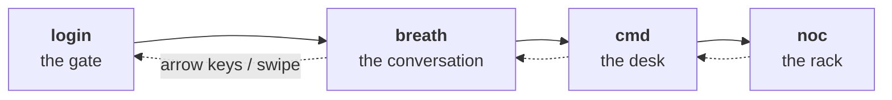

# cockpit — theme docs

Everything specific to the `cockpit` theme. Product-level docs live at the repo
root: [architecture](../../../../docs/ARCHITECTURE.md),
[workflow](../../../../docs/WORKFLOW.md),
[theme contract](../../../../docs/THEMES.md), [law](../../../../AGENTS.md).

## The four rooms

Cockpit is one horizontal deck of four rooms. They are not four dashboards;
they are four distances from the machine — you arrive, you speak, you work,
you inspect.

**`login` — the gate.** The authentication portal to JARVIS. A locked room with
one control: the badge. Cinematic, not administrative — no tables, no status,
nothing to read. It exists to make arriving feel like arriving.

**`breath` — the first portal you speak to.** The simplest possible thing:
one operator, one JARVIS, talking. No queues, no panels to manage. The night
Earth is the *backdrop* — the room is the exchange in front of it, which is
why instruments live on the rim and the dialogue rises out of the command
line. Named for what happens here, not what is drawn here.

**`cmd` — the desk.** Where the day actually gets done. The briefing, what
needs attention, the channel, the apply queue. Busy work belongs here, and so
does anything with a backlog: this is the only room allowed to be dense with
things to act on.

**`noc` — the rack.** Network and systems operations. The infrastructure
underneath, in detail, drillable to the node. Where you go when a number on
another screen looked wrong.

> **Earth is the visual; breath is the room.** The globe component is
> `ui/EarthGlobe.tsx` and its reference frame is `reference/breath.jpg`. The
> route was `#earth` until 2026-09-21; `#earth` still resolves and rewrites
> itself to `#breath`, so old bookmarks survive.

Hash routes: `#login`, `#breath`, `#cmd`, `#noc`. Arrow keys, swipe, or the
dots. The deck, the routes and the room count are the theme's, not the
engine's — a different theme may have a different number of rooms or none.

## Files

| File | What it is | Use it when |
| --- | --- | --- |
| [DESIGN.md](./DESIGN.md) | Visual contract — locked tokens, chrome language, what is allowed | Changing colour, type, density, or adding a viz |
| [COCKPIT.md](./COCKPIT.md) | Build brief — what each room contains, what to type | Implementing or altering a room |
| [COCKPIT-PLAN.md](./COCKPIT-PLAN.md) | Architecture of the four rooms and why | Understanding intent before changing layout |
| [reference/](./reference) | The four locked frames at 1920×1080 | Judging whether a room still looks right |

Acceptance is comparison against `reference/*.jpg`: same hierarchy, same teal,
same Plex, same density. Breath has no centred modal, Login has no visible
form until the badge is lifted, NOC is a schematic not a globe, CMD is a
briefing desk not a rack.

## Revisions to the locked spec

Operator requests that override the original brief are marked inline in
`COCKPIT.md` with the date and reason — search for **Revised**. They are not
drift; they are the current spec.

- **2026-09-20** — Login gained a mocked presence gate behind the badge lid,
  superseding "no form fields".
- **2026-09-20** — Breath gained a bounded, fading dialogue strip, superseding
  the "two-line toast" and narrowing the "no chat transcript" rule to "no
  scrolling transcript, no modal".
- **2026-09-21** — The `earth` room was renamed `breath`. The Earth globe is
  unchanged; the room is named for the exchange, not the backdrop.
